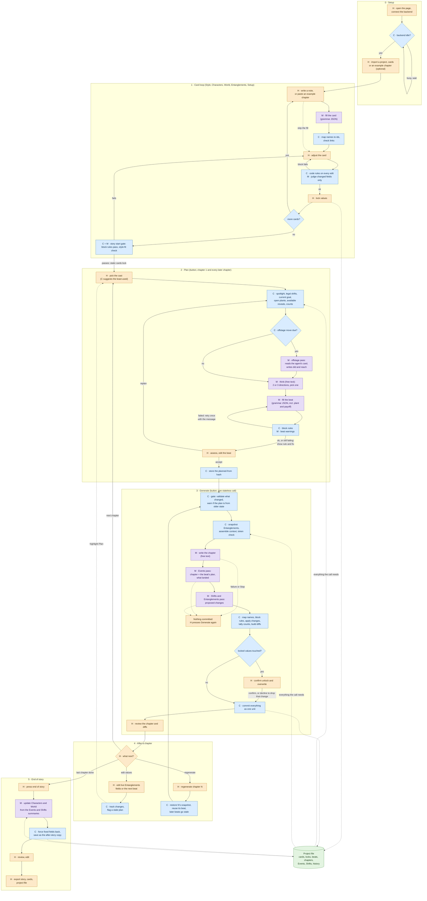

```mermaid
flowchart TD
  classDef human fill:#fde9c9,stroke:#b9770e,color:#3a2500
  classDef code fill:#d9ecff,stroke:#2e6fb3,color:#0b2a4a
  classDef model fill:#e6dcf7,stroke:#6b46b8,color:#2a1556
  classDef store fill:#e3f4e1,stroke:#3d8b37,color:#12360f

  subgraph S0["0 · Setup"]
    A1["H · open the page,<br/>connect the backend"]:::human
    A2{"C · backend idle?"}:::code
    A3["H · import a project, cards<br/>or an example chapter (optional)"]:::human
    A1 --> A2
    A2 -- "busy, wait" --> A2
    A2 -- yes --> A3
  end

  subgraph S1["1 · Card loop (Style, Characters, World, Entanglements, Setup)"]
    B1["H · write a note,<br/>or paste an example chapter"]:::human
    B2["M · fill the card<br/>(grammar JSON)"]:::model
    B3["C · map names to ids,<br/>check links"]:::code
    B4["H · adjust the card"]:::human
    B5["C · code rules on every edit<br/>M · judge changed fields only"]:::code
    B6["H · lock values"]:::human
    B7{"more cards?"}:::code
    B8["C + M · story start gate:<br/>block rules pass, style-fit check"]:::code
    B1 --> B2 --> B3 --> B4
    B1 -. "skip the fill" .-> B4
    B4 --> B5
    B5 -- "block fails" --> B4
    B5 -- ok --> B6 --> B7
    B7 -- yes --> B1
    B7 -- no --> B8
    B8 -- fails --> B4
  end

  subgraph S2["2 · Plan (button; chapter 1 and every later chapter)"]
    P1["H · pick the cast<br/>(C suggests the least-used)"]:::human
    P2["C · spotlight, legal shifts, current goal,<br/>open plants, available reveals, counts"]:::code
    P3{"C · offstage move due?"}:::code
    P4["M · offstage pass:<br/>reads the agent's card,<br/>writes did and reach"]:::model
    P5["M · think (free text):<br/>2 or 3 directions, pick one"]:::model
    P6["M · fill the beat<br/>(grammar JSON, incl. plant and payoff)"]:::model
    P7["C · block rules<br/>M · beat warnings"]:::code
    P8["H · assess, edit the beat"]:::human
    P9["C · store the planned-from hash"]:::code
    P1 --> P2 --> P3
    P3 -- yes --> P4 --> P5
    P3 -- no --> P5
    P5 --> P6 --> P7
    P7 -- "failed: retry once<br/>with the message" --> P6
    P7 -- "ok, or still failing:<br/>show rule and fix" --> P8
    P8 -- replan --> P2
    P8 -- accept --> P9
  end

  subgraph S3["3 · Generate (button, one stateless call)"]
    G1["C · gate: validate what changed,<br/>warn if the plan is from older state"]:::code
    G2["C · snapshot Entanglements,<br/>assemble context, token check"]:::code
    G3["M · write the chapter<br/>(free text)"]:::model
    G4["M · Events pass:<br/>chapter + the beat's plan,<br/>what landed"]:::model
    G5["M · Shifts and Entanglements pass:<br/>proposed changes"]:::model
    G6["C · map names, block rules, apply changes,<br/>tally counts, build diffs"]:::code
    G7{"locked values touched?"}:::code
    G8["H · confirm unlock and overwrite"]:::human
    G9["C · commit everything<br/>as one unit"]:::code
    G10["H · review the chapter and diffs"]:::human
    GF["Nothing committed:<br/>H presses Generate again"]:::human
    G1 --> G2 --> G3 --> G4 --> G5 --> G6 --> G7
    G7 -- yes --> G8
    G8 -- "confirm, or decline to drop that change" --> G9
    G7 -- no --> G9
    G9 --> G10
    G3 -. "failure or Stop" .-> GF
    G4 -.-> GF
    G5 -.-> GF
  end

  subgraph S4["4 · After a chapter"]
    NEXT{"H · what next?"}:::human
    H1["H · edit live Entanglements<br/>fields or the next beat"]:::human
    H2["C · track changes,<br/>flag a stale plan"]:::code
    H3["H · regenerate chapter N"]:::human
    H4["C · restore N's snapshot, reuse its beat,<br/>later beats go stale"]:::code
    NEXT -- "edit values" --> H1 --> H2
    NEXT -- regenerate --> H3 --> H4
  end

  subgraph S5["5 · End of story"]
    E1["H · press end of story"]:::human
    E2["M · update Characters and World<br/>from the Events and Shifts summaries"]:::model
    E3["C · force fixed fields back,<br/>save as the after-story copy"]:::code
    E4["H · review, edit"]:::human
    E5["H · export story, cards,<br/>project file"]:::human
    E1 --> E2 --> E3 --> E4 --> E5
  end

  STORE[("Project file<br/>cards, locks, beats, chapters,<br/>Events, Shifts, history")]:::store

  A3 --> B1
  B8 -- "passes: static cards lock" --> P1
  P9 --> G1
  G10 --> NEXT
  NEXT -- "next chapter" --> P1
  NEXT -- "last chapter done" --> E1
  H2 -. "highlight Plan" .-> P1
  H4 --> G1
  B6 -.-> STORE
  G9 -.-> STORE
  E3 -.-> STORE
  STORE -. "everything the call needs" .-> P2
  STORE -. "everything the call needs" .-> G2
  STORE -.-> E2
```

